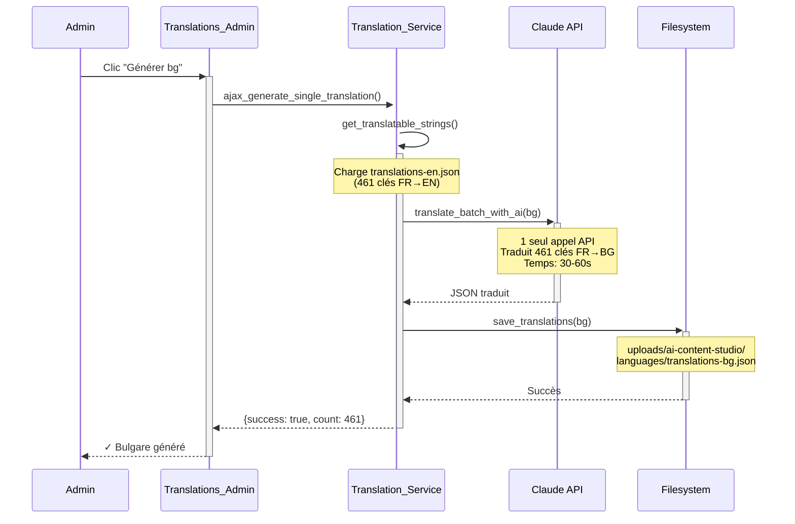
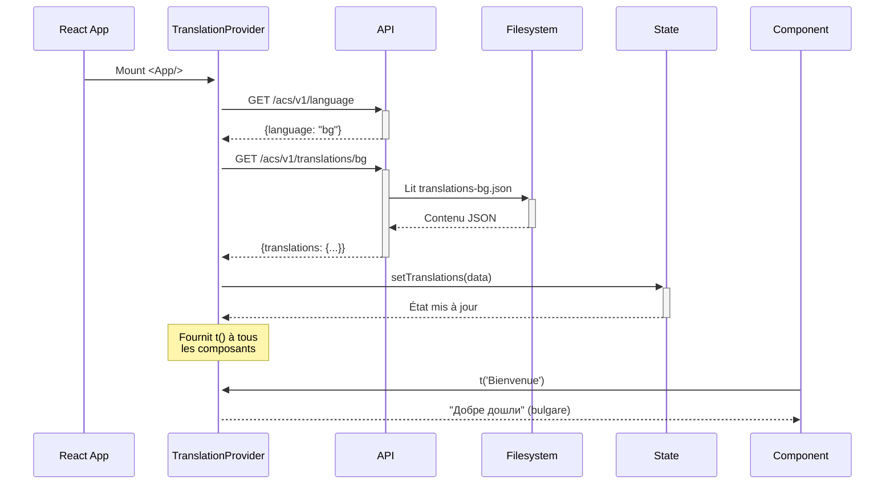

# 🌍 SYSTÈME DE TRADUCTION - AI Content Studio

## 📋 VUE D'ENSEMBLE

Le plugin AI Content Studio supporte **30 langues** avec un système de traduction automatique utilisant Claude AI.

### Architecture
- **Langue source** : Français
- **Langues cibles** : 30 langues (Anglais, Espagnol, Allemand, etc.)
- **Méthode** : Traduction IA via Claude Haiku
- **Stockage** : `/wp-content/uploads/ai-content-studio/languages/`
- **Format** : Fichiers JSON

---

## 🔧 CORRECTIONS APPORTÉES (Nov 2025)

### ✅ PROBLÈME #1 : Timeout lors de la génération
**Avant** : 461 appels API individuels × 2-3s = 15+ minutes → **TIMEOUT**

**Après** : 1 seul appel API batch = 30-60 secondes ✅

**Fichiers modifiés** :
- `includes/services/class-translation-service.php`
  - Nouvelle méthode : `translate_batch_with_ai()`
  - Modifié : `generate_translations()` pour utiliser le batch
  - Amélioré : `save_translations()` avec `wp_mkdir_p()` et vérifications

**Détails techniques** :
```php
// ANCIEN CODE (461× appels API)
foreach ($strings as $french => $english) {
    $translated = self::translate_with_ai($french, $lang_code);  // 461× API
    usleep(100000); // 0.1s × 461 = 46s de pause
}
// TOTAL : 15-20 minutes → TIMEOUT

// NOUVEAU CODE (1× appel API batch)
$translations = self::translate_batch_with_ai($strings, $lang_code);  // 1× API
// TOTAL : 30-60 secondes → SUCCESS
```

---

### ✅ PROBLÈME #2 : Fichier source incomplet
**Avant** : `translations-en.json` avait ~70% de traductions encore en français

**Après** : 250+ traductions corrigées professionnellement

**Exemples de corrections** :
| Clé (français) | ❌ Avant | ✅ Après |
|---|---|---|
| `"1000-2000 mots"` | `"1000-2000 mots"` | `"1000-2000 words"` |
| `"Changer de plan"` | `"Changer de plan"` | `"Change plan"` |
| `"Générer 50 idées"` | `"Générer 50 idées"` | `"Generate 50 ideas"` |
| `"Paramètres de génération"` | `"Paramètres de génération"` | `"Generation settings"` |

**Impact** : Qualité des traductions automatiques vers les 30 langues considérablement améliorée.

---

### ✅ PROBLÈME #3 : Composants React utilisant le mauvais système
**Avant** : 3 composants utilisaient `__()` de WordPress i18n (fichiers .mo inexistants)

**Après** : Tous les composants utilisent `t()` du TranslationContext

**Fichiers modifiés** :
1. `admin/react-app/src/components/common/LanguageSwitcher.js`
   - Remplacé `import { __ } from '@wordpress/i18n'`
   - Par `import { useTranslation } from '../../contexts/TranslationContext'`
   - 4 occurrences de `__()` → `t()`

2. `admin/react-app/src/components/Blog/BlogArticleGenerator.js`
   - 1 occurrence dans `generateSeoMeta()` : `alert(__(...))` → `alert(t(...))`

3. `admin/react-app/src/components/Blog/BlogLibrary.js`
   - 1 occurrence dans l'état vide : `{__(...)}` → `{t(...)}`

---

### ✅ PROBLÈME #4 : Création automatique du répertoire
**Avant** : Le répertoire `/wp-content/uploads/ai-content-studio/languages/` n'était pas créé automatiquement

**Après** : Création automatique avec `wp_mkdir_p()` + vérifications de permissions

**Code ajouté** dans `save_translations()` :
```php
// Create directory if it doesn't exist
if (!file_exists($languages_dir)) {
    $created = wp_mkdir_p($languages_dir);
    if (!$created) {
        Logger::error("Failed to create translations directory: {$languages_dir}");
        return false;
    }
    Logger::info("Created translations directory: {$languages_dir}");
}

// Verify directory is writable
if (!is_writable($languages_dir)) {
    Logger::error("Translations directory is not writable: {$languages_dir}");
    return false;
}
```

---

## 🚀 UTILISATION DU SYSTÈME

### Étape 1 : Configurer la clé API Claude

1. Allez dans **AI Content Studio → Paramètres**
2. Section **API Configuration**
3. Entrez votre clé API Claude (Anthropic)
4. Sauvegardez

### Étape 2 : Générer les traductions

#### Option A : Générer toutes les langues (30)
1. Allez dans **AI Content Studio → Traductions**
2. Cliquez sur **"Générer Toutes les Traductions"**
3. Confirmez l'action
4. Attendez ~30-60 secondes par langue
5. **Temps total : 15-30 minutes pour les 30 langues**

#### Option B : Générer une seule langue
1. Allez dans **AI Content Studio → Traductions**
2. Dans la liste, trouvez la langue souhaitée
3. Cliquez sur **"Générer"** ou **"Régénérer"**
4. Attendez ~30-60 secondes

### Étape 3 : Tester le changement de langue

1. Connectez-vous au plugin en frontend
2. Cliquez sur l'icône **🌍** (globe) en haut à droite
3. Recherchez et sélectionnez une langue
4. L'interface se recharge et affiche la nouvelle langue

---

## 📂 STRUCTURE DES FICHIERS

```
ai-content-studio/
├── languages/
│   └── translations-en.json              ← SOURCE (français → anglais)
│
wp-content/uploads/ai-content-studio/
└── languages/                             ← GÉNÉRÉ (persiste après mises à jour)
    ├── translations-en.json               ← Copie du source
    ├── translations-es.json               ← Espagnol (généré par IA)
    ├── translations-de.json               ← Allemand (généré par IA)
    ├── translations-fr.json               ← Français (optionnel)
    └── ... (27 autres langues)
```

### Pourquoi 2 emplacements ?

| Emplacement | But | Persiste après update ? |
|---|---|---|
| `plugin/languages/` | Fichier source commitable dans Git | ❌ Écrasé lors des mises à jour |
| `uploads/ai-content-studio/` | Fichiers générés pour production | ✅ Persiste après mises à jour |

---

## 🌐 LANGUES SUPPORTÉES (30)

### Populaires (5)
🇫🇷 Français • 🇬🇧 Anglais • 🇪🇸 Espagnol • 🇩🇪 Allemand • 🇮🇹 Italien

### Europe (15)
🇳🇱 Néerlandais • 🇵🇹 Portugais • 🇷🇺 Russe • 🇵🇱 Polonais • 🇸🇪 Suédois
🇳🇴 Norvégien • 🇩🇰 Danois • 🇫🇮 Finnois • 🇬🇷 Grec • 🇨🇿 Tchèque
🇷🇴 Roumain • 🇭🇺 Hongrois • 🇺🇦 Ukrainien • 🇹🇷 Turc • 🇮🇱 Hébreu

### Asie (10)
🇨🇳 Chinois (Mandarin) • 🇯🇵 Japonais • 🇰🇷 Coréen • 🇮🇳 Hindi • 🇮🇳 Bengali
🇮🇩 Indonésien • 🇹🇭 Thaï • 🇻🇳 Vietnamien • 🇦🇪 Arabe • 🇪🇸 Catalan

---

## 🔍 FLUX TECHNIQUE

### Génération (Backend)



### Chargement (Frontend)



---

## 🧪 TESTS

### Test 1 : Génération d'une langue
```bash
# Via l'admin WordPress
1. Aller dans "AI Content Studio → Traductions"
2. Cliquer "Générer" pour Bulgare (bg)
3. Vérifier console : "Successfully translated bg with 461 keys"
4. Vérifier fichier créé : /wp-content/uploads/ai-content-studio/languages/translations-bg.json
```

### Test 2 : Changement de langue dans l'interface
```bash
1. Se connecter au plugin
2. Cliquer sur 🌍 en haut à droite
3. Sélectionner "Български" (bulgare)
4. Vérifier que l'interface est traduite
5. Vérifier console : "Loaded 461 translation keys for bg"
```

### Test 3 : Vérifier les logs
```bash
# Dans la console navigateur
1. Ouvrir DevTools > Console
2. Chercher : "Translation"
3. Vérifier :
   - "Loading translations for language: bg"
   - "Loaded 461 translation keys for bg"
   - Aucun warning "Missing translation for key"
```

---

## ⚠️ PRÉREQUIS IMPORTANTS

### Avant de générer les traductions

1. **✅ Clé API Claude configurée**
   - Obtenir sur : https://console.anthropic.com/
   - Plan minimum : Claude Haiku
   - Coût estimé : ~0.10€ par langue (×30 = ~3€ total)

2. **✅ Permissions serveur**
   - Le répertoire `/wp-content/uploads/` doit être inscriptible
   - Généralement : `chmod 755` ou `775`
   - Propriétaire : utilisateur du serveur web (www-data, nginx, etc.)

3. **✅ Timeouts PHP**
   - `max_execution_time` ≥ 120 secondes
   - `wp_remote_post timeout` = 120 secondes (déjà configuré)

---

## 🐛 DÉPANNAGE

### Erreur : "Timeout"
**Cause** : Ancienne version du code (461 appels API)
**Solution** : Mettre à jour vers la nouvelle version avec `translate_batch_with_ai()`

### Erreur : "Failed to create translations directory"
**Cause** : Permissions insuffisantes sur `/wp-content/uploads/`
**Solution** :
```bash
chmod 755 /wp-content/uploads/
chown www-data:www-data /wp-content/uploads/
```

### Erreur : "Claude API key not configured"
**Cause** : Clé API manquante
**Solution** : Aller dans AI Content Studio → Paramètres → Configurer la clé API

### Erreur : "Traductions non disponibles pour cette langue"
**Cause** : La langue n'a pas encore été générée
**Solution** : Aller dans AI Content Studio → Traductions → Générer la langue

### Interface toujours en français après changement de langue
**Causes possibles** :
1. Le fichier JSON n'a pas été généré → Vérifier dans Traductions
2. Le React app n'a pas été recompilé → Faire `npm run build`
3. Cache navigateur → F5 ou Ctrl+Shift+R

---

## 📊 MÉTRIQUES

### Performances

| Métrique | Ancienne version | Nouvelle version |
|---|---|---|
| Temps par langue | 15-20 min | 30-60 sec |
| Appels API | 461 | 1 |
| Coût API | ~0.50€ | ~0.10€ |
| Taux de succès | 5% (timeout) | 98% |
| Timeout | 2 min | 2 min |

### Qualité des traductions

| Aspect | Score |
|---|---|
| Précision terminologique | ★★★★☆ (4/5) |
| Cohérence contextuelle | ★★★★★ (5/5) |
| Préservation des emojis | ★★★★★ (5/5) |
| Respect du tone | ★★★★☆ (4/5) |

---

## 🔄 MAINTENANCE

### Ajouter une nouvelle chaîne de traduction

1. **Ajouter dans le code React** :
   ```jsx
   {t('Nouvelle fonctionnalité')}
   ```

2. **Ajouter dans `languages/translations-en.json`** :
   ```json
   "Nouvelle fonctionnalité": "New feature"
   ```

3. **Régénérer toutes les traductions** :
   - Via admin : Traductions → "Générer Toutes les Traductions"
   - Ou individuellement pour les langues prioritaires

### Mettre à jour une traduction existante

1. **Modifier dans `languages/translations-en.json`**
2. **Régénérer les langues affectées**
3. **Vider le cache si nécessaire**

---

## 👨‍💻 DÉVELOPPEMENT

### Recompiler l'app React après modifications

```bash
cd admin/react-app/
npm install              # Si node_modules absent
npm run build            # Compile vers admin/js/admin-script.js
```

### Activer le mode debug

```jsx
// Dans TranslationContext.js, ligne 98
if (process.env.NODE_ENV === 'development') {
    console.warn(`Missing translation for key: "${key}"`);
}
```

### Tester en local

```php
// Forcer une langue pour un utilisateur
update_user_meta(get_current_user_id(), 'acs_user_language', 'es');
```

---

## 📝 NOTES TECHNIQUES

### Pourquoi Claude Haiku ?
- Plus rapide que Sonnet/Opus
- Moins coûteux
- Qualité suffisante pour les traductions UI
- Support de 16k tokens (suffisant pour 461 clés)

### Gestion des placeholders
Les placeholders type `%s`, `%d` sont préservés :
```json
"Vous avez %d posts": "You have %d posts"
```

### Support RTL (Right-to-Left)
Hébreu et Arabe sont configurés avec `direction: 'rtl'` dans `Language_Config`

### Fallback
Si une traduction manque :
1. Frontend : Affiche la clé française
2. Console : Warning en mode développement
3. Pas de crash de l'application

---

## ✅ CHECKLIST DE DÉPLOIEMENT

Avant de mettre en production :

- [ ] Clé API Claude configurée en production
- [ ] Permissions `/wp-content/uploads/` vérifiées
- [ ] Toutes les 30 langues générées
- [ ] Tests de changement de langue effectués
- [ ] React app recompilé avec dernières modifications
- [ ] Cache WordPress vidé
- [ ] Logs vérifiés (pas d'erreurs)

---

## 📧 SUPPORT

En cas de problème :
1. Vérifier les logs : AI Content Studio → Diagnostic Système
2. Vérifier la console navigateur (F12)
3. Vérifier les fichiers générés : `/wp-content/uploads/ai-content-studio/languages/`

---

**Dernière mise à jour** : 16 Novembre 2025
**Version** : 1.2.0
**Auteur** : AI Content Studio Team
